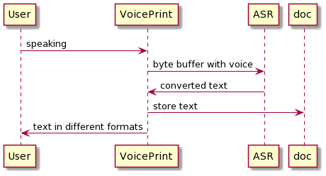

# Voice Printing and Audio Content Categorization in streaming

This is a simple service which will help you to do the content categorization.
It's based on Netty + Aho-Corasick (could be replaced by the categorization neural network).

Fill free to use.

### Sequence diagram
 

### How to test quickly

- create AWS account and pass AWS credentials in some way;
- prepare some audio file with English speech in `wav` format  
- install ffmpeg as described here: https://www.ffmpeg.org/download.html
- run from the terminal the following command: `ffmpeg -re -i ~/Downloads/Top50AWSServices.wav -acodec pcm_s16le -f s16le -ac 1 -ar 16000 tcp://localhost:8081`
- see categorized content in the console

### Enhancements 

- add AWS and Azure ASRs
- make a possibility to write data inside file
- create frontend :)