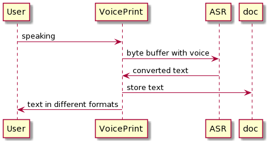

# Voiceprint

This is a simple service which helps you to avoid printing text manually.
It uses neural network ASR engine under the hood which is converting your voice into text on flight.

Another part of engine will prepare documents with different formats for your future operations.

Fill free to use.

### Sequence diagram
 
